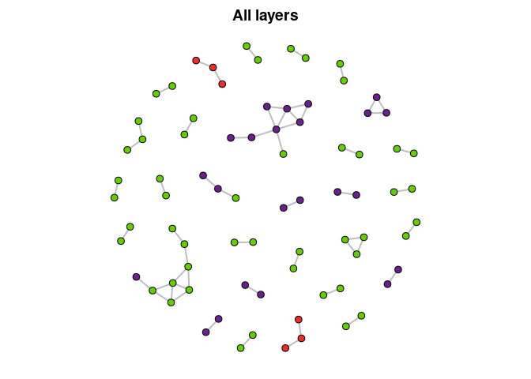
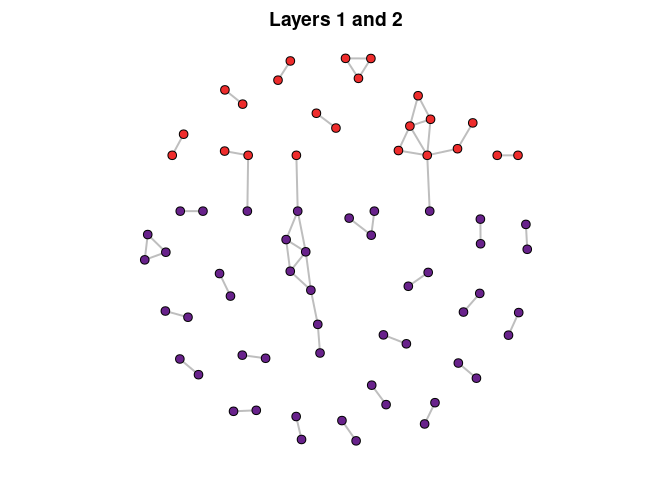

# Archeofrag 
an R package for refitting and stratigraphic analysis in archeology

[](https://www.repostatus.org/#active)
[](https://www.tidyverse.org/lifecycle/#maturing)
[](https://github.com/sebastien-plutniak/archeofrag/actions)
[](https://travis-ci.org/sebastien-plutniak/archeofrag)
[](https://www.r-project.org/Licenses/GPL-2)
[](https://doi.org/10.5281/zenodo.4271900)


## Installation
The development version can be installed from GitHub with:


```r
# install.packages("devtools")
devtools::install_github("sebastien-plutniak/archeofrag")
```
For an interactive demonstration, see also the [Shiny application](https://analytics.huma-num.fr/Sebastien.Plutniak/archeofrag/).


- [**Introduction**](#Introduction)
- [**Building fragmentation graphs**](#building-fragmentation-graphs): [Using empirical data](#using-empirical-data), [Generating artificial data](#generating-artificial-data)
- [**Manipulating fragmentation graphs**](#manipulating-fragmentation-graphs)
- [**Measuring the admixture of two layers**](#measuring-the-admixture-of-two-layers)
- [**Characterising fragmentation within a layer**](#characterising-fragmentation-within-a-layer)
- [**More on artificial graphs**](#more-on-artificial-graphs): [Parameters](#parameters), [Hypotheses testing](#hypotheses-testing)


## Introduction 


```r
library(archeofrag)
```

On the field, archaeologists distinguish  between two main categories of facts: layers and archaeological objects.
Layers are spatially ordered masses of matter that archaeologists address using the principles of stratigraphy. Layers are considered as containers: they can include the so-called archaeological objects (bones, lithic pieces, pottery sherds, etc.).
Whereas most objects have clear boundaries, layers have fuzzy boundaries.
In addition, a distinction between two layers does not imply that their contents are also different. The relationships between layers and those between their contents are independent, due to the post-depositionnal processes: two different layers from a sedimentological perspective can contain objects related to the same chronological period; to the contrary, post-depositionnal processes can mix two different sets of objects into a single layer.
Consequently, a dialectical study of the containers and their contents is necessary.

The fragments of an object can be concentrated into a single layer or, to the contrary, scattered into two or more layers. Consequently, studying the location and relationships between fragments is worthwhile to assess the relevance of the boundaries between layers. The so-called “refitting analysis” serves this purpose: archaeologists try to identify fragments with matching edges, proving that they were parts of the same initial object, in which they had adjacent locations.

The *Archeofrag* package includes a set of tools for this purpose. 
The approach implemented in this package relies on graphs to model the relationships between fragments and layers. Fragments are represented by vertices, which are connected by an edge if they have “connecting” edges. The information about the layer in which the fragments are located is integrated as a vertex attribute.
Two main questions are addressed:

1. measuring the cohesion of the layers and, when applicable, their admixture;
2. determining the topological properties of the relationships between fragments within a given layer.


## Building fragmentation graphs

There are two ways to input data in *Archeofrag*: 

* loading empirical observations, and
* generating simulated data.

### Using empirical data

The package comes with an example data set, called “Liang Abu” (from the name of a cave in Borneo). It contains three tables:

* a table with information about the fragments (a unique identifier, and other information such as the layer),
* a table with the connection relationships between these fragments (each row contains the unique identifiers of two connecting fragments),
* a table with the similarity relationships between them (two fragments are said to be “similar” if they seem to come from the same object but do not have connecting edges. Similarity relationships are discussed in this presentation).

The `make_frag_object` function builds objects with the class “frag”. The use of this builder is not a requirement of the other *Archeofrag* functions, however, it ensures that the data are suitable for the next steps of the analysis.
The `make_cr_graph` is then used to build an igraph graph object representing the connection relationships.


```r
data(LiangAbu)
abu.g <- make_frag_object(df.cr, fragments = fragments.info)
abu.g <- make_cr_graph(abu.g)
```

### Generating artificial data

The other way to get data to use with *Archeofrag* is the `frag.simul.process` function to generate artificial cases.
The next command generates a situation in which 20 initial objects (corresponding to the “connected components” of a graph) are fragmented into a total of 50 pieces and spread between two layers.
The `frag.simul.process` function has many options but, at this step, we use it in its simplest form.


```r
simul.g <-frag.simul.process(n.components = 20, vertices = 50)
```

## Manipulating fragmentation graphs


Once we have a fragmentation graph, several *Archeofrag* functions are convenient for a first examination of the data.
First, the `frag.graph.plot` function generates a visual representation of the graph, here for the Liang Abu data:


```r
frag.graph.plot(abu.g, "layer")
```



We can then plot the artificial fragmentation graph:


```r
frag.graph.plot(simul.g, "layer")
```


Note that this artificial graph has two layers, whereas the Liang Abu graph includes fragments from three layers.
The `frag.get.layers.pair` function is a convenient function to extract a pair of layers.


```r
abu.g12 <- frag.get.layers.pair(abu.g, "layer", c("1", "2"))
```

Let's now plot the connected fragments from layer 1 and 2 of Liang Abu:


```r
frag.graph.plot(abu.g12, "layer")
```



In addition, the `frag.get.layers` enables to extract as much layers as needed, for example the first layer of our artificial graph:

```r
frag.get.layers(simul.g, "layer", sel.layers = "1")
#> $`1`
#> IGRAPH 1a01c98 UN-- 25 17 -- 
#> + attr: frag_type (g/c), name (v/c), object.id (v/n), layer (v/c)
#> + edges from 1a01c98 (vertex names):
#>  [1] 1 --2  3 --4  5 --6  7 --8  9 --10 11--12 13--14 15--16 17--18 19--20
#> [11] 14--21 11--22 12--22 1 --23 7 --24 8 --24 16--25
```


## Measuring the admixture of two layers

In this section, we are interested in determining numerical values for the cohesion (i.e. self-adhesion) of a layer and, conversely, the admixture of two layers.

The `frag.relations.by.layers`  function enables a first appreciation by returning the count of intra-layers and inter-layers relationships. 


```r
frag.relations.by.layers(simul.g, "layer")
#>    
#>      1  2
#>   1 17  0
#>   2  0 18
```

The diagonal of the matrix contain the number of intra-layers relationships and the other values refer to inter-layers relationships. Note that our simulated graph does not has connection relationships between layers 1 and 2.
It is time to introduce a new parameter of the `frag.simul.process`, namely its `disturbance` argument. It determines the proportion of fragments which will be randomly displaced from a layer to the other one. The default value of this parameter is 0, what explains why our `simul.g` graph has no inter-layers relationships.
Let's create a new artificial graph:


```r
simul2.g <-frag.simul.process(n.components=20, vertices=50, disturbance=.1)
frag.relations.by.layers(simul2.g, "layer")
#>    
#>      1  2
#>   1 19  3
#>   2  3 12
```
As expected, this graph has inter-layers connections.

In addition, the `frag.get.parameters` function reports general information about a fragmentation graph:

* number of components (representing initial objects)
* number of vertices (i.e. fragments)
* number of edges (i.e. connection relationships)
* balance: proportion of fragments in the smaller layer
* components balance: proportion of components in the smaller layer
* disturbance: proportion of fragments which might have move from a layer to the other one
* aggregation factor: reflects the (in)homogeneity of the edge distribution between the components of the graph.


```r
frag.get.parameters(abu.g12, "layer")
#> $n.components
#> [1] 28
#> 
#> $vertices
#> [1] 72
#> 
#> $edges
#> [1] 52
#> 
#> $balance
#> [1] 0.3188406
#> 
#> $components.balance
#> [1] 0.29
#> 
#> $disturbance
#> [1] 0.04166667
#> 
#> $aggreg.factor
#> [1] 0.7031073
#> 
#> $planar
#> [1] TRUE
```

Compare, for example, the properties of the two simulated graphs:


```r
cbind(
  frag.get.parameters(simul.g, "layer"),
  frag.get.parameters(simul2.g, "layer")
)
#>                    [,1]      [,2]     
#> n.components       20        20       
#> vertices           50        50       
#> edges              35        34       
#> balance            0.5       0.5777778
#> components.balance 0.5       0.56     
#> disturbance        0         0.06     
#> aggreg.factor      0.5168904 0.5302024
#> planar             TRUE      TRUE
```


The *Archeofrag* package also implements a more sophisticated method to measure the cohesion and admixture of two layers. 
The first step is to weight the edges of the graph. This is done with the `frag.edges.weighting` function:


```r
E(simul.g)$weight
#> NULL
simul.g <- frag.edges.weighting(simul.g, "layer")
E(simul.g)$weight
#>  [1] 3 3 2 2 4 4 4 2 4 4 4 3 3 2 2 3 3 2 2 2 2 3 4 4 4 3 3 2 2 5 6 5 5 5 3
```
Note that the weighting of the edges is mandatory, otherwise an error is raised.

Then, the `frag.layers.cohesion`  function is used to calculate the cohesion value of each layer:


```r
frag.layers.cohesion(simul.g, "layer")
#>         1         2 
#> 0.4561404 0.5438596
```

Compare with the second artificial graph:


```r
simul2.g <- frag.edges.weighting(simul2.g, "layer")
frag.layers.cohesion(simul2.g, "layer")
#>         1         2 
#> 0.6002183 0.3092033
```
These values tell how much each layer is cohesive (self-adhesive).


In complement, the `frag.layers.admixture` function returns a value quantifying the mixture between two layers:


```r
frag.layers.admixture(simul.g, "layer")
#> [1] 0
frag.layers.admixture(simul2.g, "layer")
#> [1] 0.09057839
```


## Characterising fragmentation within a layer

The second dimension of the method implemented in *Archaeofrag* is about characterising the layers based on the topological properties of the relationships between the fragments they contain.
Several functions are provided for this purpose. The archaeological interpretation of the numerical values depends on the type of material (lithic, pottery, etc.) and the completeness or incompleteness of the object.

Let's start by using igraph's function to create a graph for each layer of our mixed artificial graph:


```r
simul.l1.g <- induced_subgraph(simul2.g, V(simul2.g)[V(simul2.g)$layer==1])
simul.l2.g <- induced_subgraph(simul2.g, V(simul2.g)[V(simul2.g)$layer==2])
```


In a graph, a cycle is a path in which the only repeated vertices are the first and last vertices. 
The `frag.cycles` function search for cycles in a graph and returns the number of cycles found for different cycle lengths. 
The `kmax` parameter determines  the maximal length of the cycles to look for.
Let's compare the cycles found in two layers of the artificial graph:


```r
frag.cycles(simul.l1.g, kmax=5)
#> 3-cycles 4-cycles 5-cycles 
#>        3        1        0
```


```r
frag.cycles(simul.l2.g, kmax=5)
#> 3-cycles 4-cycles 5-cycles 
#>        1        0        0
```


The `frag.path.lengths` function the distribution of the path lengths in the graph. 
It returns a vector whose first first element is the frequency of the paths of length 1, the second element is the frequency of the paths of length 2, etc. 
If the `cumulative` parameter is set to `TRUE`, the function returns the cumulative relative frequency of the path lengths.


```r
frag.path.lengths(simul.l1.g)
#> [1] 19  4  1
frag.path.lengths(simul.l2.g, cumulative=T)
#> [1] 1.0000000 0.1666667
```

In a graph, the shortest path between two vertices is the path including the less number of edges. The diameter of a graph is its longest shortest path.
The `frag.diameters` function calculates the diameter of each component of the graph and returns the frequency of the values. If the `cumulative` parameter is set to `TRUE`, the function returns the cumulative relative frequency of the diameters.


```r
frag.diameters(simul.l1.g)
#> 1 2 3 
#> 9 2 1
frag.diameters(simul.l2.g)
#> 1 2 
#> 9 2
```

## More on artificial graphs

### Parameters

The `frag.simul.process` function offers several other options to control the features of the simulation.

`initial.layers` is a crucial parameter. It determines the method used to construct the graph and, accordingly, the underlying formation process hypothesis. It takes as value 2 (default value) or 1.
If the value is 2, then 

1. the initial objects (components) are placed in two different layers, 
2. these objects are fragmented, 
3. some fragments are moved as determined by the value `disturbance` parameter.

If the value of `initial.layers`is 1, then 

1. the initial objects are considered to belong to a unique layer,
2. the fragmentation process is applied, 
3. layers are attributed to the fragments, 
4. disturbance is applied.

The `vertices` and `edges` parameters are related: at least one of them must be set, or both (only if `initial.layers` is set to 1). Note that using both parameters at the same time increases the constraints and reduces the number of possible solutions to generate the graph.
When there is no solution, an error is raised and a message suggests how to change the parameters.

The `balance` argument determines the number of fragments in the smaller layer (**before** the application of the disturbance process).
The `components.balance` also determines the contents of the two layers by affecting the  distribution of the initial objects (components). Note that this argument is used only when `initial.layers` is set to 2.

The `aggreg.factor` parameter affects the distribution of the sizes of the components: this  distribution tends to be more unequal when  `aggreg.factor` has values close to 1. 

Finally, the `planar` argument determines if the graph generated has to be planar or not (a graph is planar when it can be  drawn on a plane, without edges crossing).
An example of a complete setting of the function is:


```r
frag.simul.process(initial.layers = 1,
                   n.components = 20,
                   vertices = 50, edges = 40,
                   disturbance = .1,
                   balance = .4,
                   components.balance = .4,
                   aggreg.factor = 0,
                   planar = T)
#> IGRAPH d939fe8 UN-- 50 40 -- 
#> + attr: frag_type (g/c), name (v/n), object.id (v/n), layer (v/c)
#> + edges from d939fe8 (vertex names):
#>  [1]  1-- 2  3-- 4  5-- 6  7-- 8  9--10 11--12 13--14 15--16 17--18 19--20
#> [11] 21--22 23--24 25--26 27--28 29--30 31--32 33--34 35--36 37--38 39--40
#> [21] 12--41 34--42 17--43 39--44  6--45 28--46 36--47 22--48  9--49  3--50
#> [31] 21--48 35--47  4--50 10--49  5--45 18--43 27--46 11--41 33--42 40--44
```

### Hypotheses testing

Two methods are possible (set by the `initial.layers` parameter) to enable to test empirical results against simulated results generated based from two different hypotheses. The most likely scenario is identified from the simulated results closer to the empirical results.

Note that the `frag.get.parameters` returns a list whose elements are named with the parameters names, what is a handy way to set the simulator.


```r
params <- frag.get.parameters(abu.g12, "layer")
```


```r
test.2layers.g <-frag.simul.process(initial.layers = 2,
                              n.components = params$n.components,
                              vertices = params$vertices,
                              disturbance = params$disturbance,
                              aggreg.factor = params$aggreg.factor,
                              planar = params$planar)

test.1layer.g <-frag.simul.process(initial.layers = 2,
                              n.components = params$n.components,
                              vertices = params$vertices,
                              disturbance = params$disturbance,
                              aggreg.factor = params$aggreg.factor,
                              planar = params$planar)
```

As much graphs with these settings can be generated, to compare the distribution of their properties with the empirical values.
The simulator is embedded into a function with its parameters set for the "two initial layers" hypothesis:


```r
run.test2 <- function(x){
  frag.simul.process(initial.layers = 2,
                              n.components = params$n.components,
                              vertices = params$vertices,
                              disturbance = params$disturbance,
                              aggreg.factor = params$aggreg.factor,
                              planar = params$planar)
}
```

The function is then run a sufficient number of times:

```r
test2.results <- lapply(1:40, run.test2)
```

We can then compare the distribution of, for instance, the number of edges to the empirical value observed at Liang Abu (red line):


```r
edges.res <- sapply(test2.results,
                    function(g) frag.get.parameters(g, "layer")$edges)
plot(density(edges.res), main="Edges")
abline(v=params$edges, col="red")
```


```
#> Warning in par(pardefault): le paramètre graphique "cin" ne peut être changé
#> Warning in par(pardefault): le paramètre graphique "cra" ne peut être changé
#> Warning in par(pardefault): le paramètre graphique "csi" ne peut être changé
#> Warning in par(pardefault): le paramètre graphique "cxy" ne peut être changé
#> Warning in par(pardefault): le paramètre graphique "din" ne peut être changé
#> Warning in par(pardefault): le paramètre graphique "page" ne peut être changé
```
