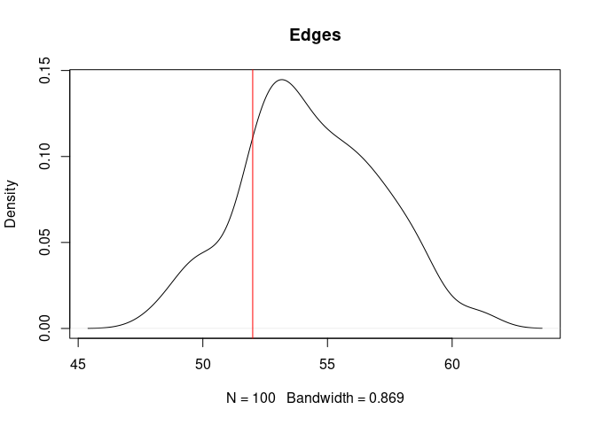
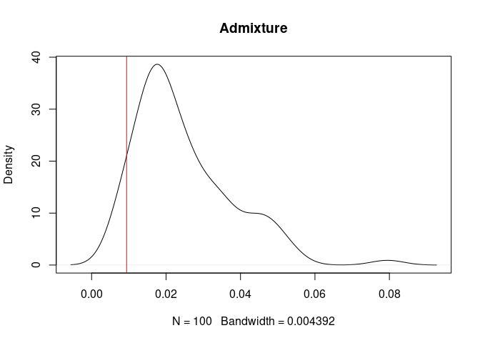
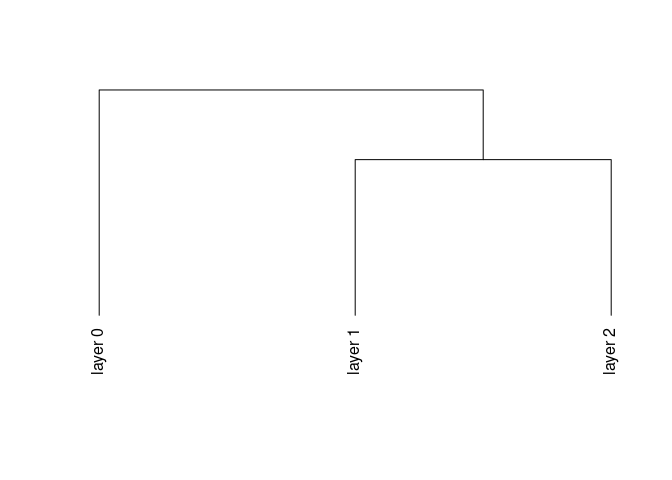

# Archeofrag 
an R package for refitting and stratigraphic analysis in archeology

[](https://www.repostatus.org/#active)
[](https://www.tidyverse.org/lifecycle/#maturing)
[](https://github.com/sebastien-plutniak/archeofrag/actions)
[](https://travis-ci.org/sebastien-plutniak/archeofrag)
[](https://cran.r-project.org/package=archeofrag)
[](https://cran.r-project.org/web/checks/check_results_archeofrag.html)
[](https://cran.r-project.org/package=archeofrag)
[](https://www.r-project.org/Licenses/GPL-2)
[](https://doi.org/10.5281/zenodo.4294066)


- [**Installation**](#installation)
- [**Building fragmentation graphs**](#building-the-fragmentation-graph)
- [**Edge weighting, cohesion and admixture computation**](#edge-weighting-cohesion-and-admixture-computation)
- [**Testing layer formation hypotheses using simulated data**](#testing-layer-formation-hypotheses-using-simulated-data): [Generating artificial fragmentation graphs](#generating-artificial-fragmentation-graphs), [Testing hypotheses](#testing-hypotheses)
- [**Assessing spatial unit boundaries using similarity relationships**](#assessing-spatial-unit-boundaries-using-similarity-relationships)
- [**Characterising spatial units from their fragmentation**](#characterising-spatial-units-from-their-fragmentation)
 

# Installation
The development version can be installed from GitHub with:


```r
# install.packages("devtools")
devtools::install_github("sebastien-plutniak/archeofrag")
```

Note that *Archeofrag* requires the *RBGL* package available through *Bioconductor*:

```r
if (!requireNamespace("BiocManager", quietly = TRUE))
    install.packages("BiocManager")
BiocManager::install("RBGL")
```

For an interactive demonstration, see also the [Shiny application](https://analytics.huma-num.fr/Sebastien.Plutniak/archeofrag/).


# Building the fragmentation graph

The `Archeofrag` package comes with a small example data set called “Liang Abu”, related to the pottery fragments found on the surface and in the first two layers of the Liang Abu rock shelter. The data set contains three data frames:

* a table with information about the fragments (a unique identifier, the layer, their length and width, etc.),
* a table with the connection relationships between these fragments (each row contains the unique identifiers of two refitting fragments),
* a table with the similarity relationships between these fragments (two fragments are termed “similar” if they seem to come from the same object but do not have connecting edges. 

The `make_frag_object` function builds objects with the class “frag”. 
Frag objects are not required by the other `Archeofrag` functions, however, using them ensures that the data are suitable for the next steps of the analysis.
The `make_cr_graph` function takes a frag object and generates an `igraph` graph object representing the connection relationships.


```r
library(archeofrag)
data(LiangAbu)
abu.frag <- make_frag_object(cr=df.cr, fragments=fragments.info)
abu.g <- make_cr_graph(abu.frag)
```

# Visualisation and subgraph extraction

Several `Archeofrag` functions ensure that the first examination of the data is easy. 
The `frag.relations.by.layers` function returns a matrix with the number of relationships within and between spatial units (e.g., stratigraphic layer).
 

```r
frag.relations.by.layers(abu.g, "layer")
#>    
#>      0  1  2
#>   0  4      
#>   1  0 18   
#>   2  0  3 31
```
The diagonal of the matrix gives the number of intra-layer relationships, and the other values refer to inter-layer relationships. 
Here, for example, there are 31 connection relationships  within layer 2, and 3 connection relationships between layers 1 and 2. No connection relationship was found between the surface (“0”) and layer 2.

The `frag.graph.plot` function generates a visual representation of the graph:


```r
par(mar=c(1, 0, 2, 0))
frag.graph.plot(abu.g, layer.attr="layer", main="All layers")
```


The fragments are coloured by layer and the three inter-layer relationships can be observed.

Let us now focus on layers 1 and 2. The `frag.get.layers.pair` function allows the user to extract a pair of layers.


```r
abu.g12 <- frag.get.layers.pair(abu.g, layer.attr="layer",
                                sel.layers=c("1", "2"))
```

This subgraph is drawn with the `frag.graph.plot` function:


```r
par(mar=c(1, 0, 2, 0))
frag.graph.plot(abu.g12, layer.attr="layer", main="Layers 1 and 2")
```


The function has a different behaviour if applied to a fragmentation graph with only two spatial units: the nodes are vertically localised to reflect their location in the two spatial units. In addition, note that standard `plot` arguments can be passed to the `frag.graph.plot` function, e.g., the `main` argument to define the plot's title.

The `frag.get.layers.pair` function has additional parameters to set the minimum size of the connected fragments sets (`size.mini`) and to extract only the sets of connected fragments which include relationships between the two spatial units (`mixed.components.only`). 


```r
frag.get.layers.pair(abu.g, layer.attr="layer", sel.layers=c("1", "2"),
                     size.mini=2, mixed.components.only=TRUE)
#> IGRAPH 1344903 UN-- 19 22 -- 
#> + attr: frag_type (g/c), name (v/c), layer (v/c), zmin (v/n), zmax
#> | (v/n), square (v/c), sherd.type (v/c), thickness (v/n), length (v/n),
#> | membership (v/n), type_relation (e/c)
#> + edges from 1344903 (vertex names):
#>  [1] 187--188 165--195 195--196 195--197 196--198 195--204 196--204 197--204
#>  [9] 198--204 195--25  188--250 27 --28  27 --366 27 --367 28 --367 366--367
#> [17] 27 --371 332--371 366--371 25 --8   28 --835 835--836
```

Additionally, the `frag.get.layers` function can  extract a set of specified spatial unit(s), e.g., the refits within the first layer at Liang Abu:


```r
frag.get.layers(abu.g, layer.attr="layer", sel.layers="1")
#> $`1`
#> IGRAPH 1fae2e5 UN-- 23 18 -- 
#> + attr: frag_type (g/c), name (v/c), layer (v/c), zmin (v/n), zmax
#> | (v/n), square (v/c), sherd.type (v/c), thickness (v/n), length (v/n),
#> | type_relation (e/c)
#> + edges from 1fae2e5 (vertex names):
#>  [1] 123--124  187--188  195--196  195--197  196--198  195--204  196--204 
#>  [8] 197--204  198--204  195--25   301--302  313--314  392--408  435--441 
#> [15] 477--478  25 --8    435--9999 441--9999
```

# Edge weighting, cohesion and admixture computation

Weighting the edges is a crucial step in the TSAR / `Archeofrag` approach because it integrates the topological properties of the fragmentation graph.
The `frag.edges.weighting` function assigns a value to each edge based on the topological properties of the vertices this edge connects.
 

```r
abu.g12 <- frag.edges.weighting(abu.g12, layer.attr="layer")
```

Then, the `frag.layers.cohesion` function is used to calculate the cohesion value of each layer.


```r
frag.layers.cohesion(abu.g12, layer.attr="layer")
#>     cohesion1 cohesion2
#> 1/2 0.3977727 0.5927749
```

These values determine the cohesion (self-adherence) of the spatial units (here, layers) based on the distribution of the refitting relationships.
Note that the weighting of the edges is mandatory for the computation of cohesion. Using the `frag.layers.cohesion` function on a non-weighted fragmentation graph will give an error.

In addition to topological properties, the computation of edge weights can optionally include other parameters, namely the morphometry of the fragments and the distance between the location where they were found.
In the following example, the length of the pottery sherds is used as a morphometric proxy:


```r
abu.g12morpho <- frag.edges.weighting(abu.g12,
                                      layer.attr="layer",
                                      morphometry="length")
```

Using the morphometry parameter results, layer 2 is more cohesive than layer 1:


```r
frag.layers.cohesion(abu.g12morpho, layer.attr="layer")
#>     cohesion1 cohesion2
#> 1/2 0.3263172  0.666898
```

In addition, the `frag.layers.admixture` function returns a value quantifying the admixture between the two layers. Let us compare the results obtained when the morphometry is used or not:


```r
# topology-based weighting:
frag.layers.admixture(abu.g12, layer.attr="layer")
#>   admixture 
#> 0.009452435
# topology + morphometry weighting:
frag.layers.admixture(abu.g12morpho, layer.attr="layer")
#>   admixture 
#> 0.006784769
```

In this case, using the morphometry in the computation lowers the admixture between layers 1 and 2 at Liang Abu.

# Testing layer formation hypotheses using simulated data
Simulation-based hypotheses can be tested by combining the functions offered by `Archeofrag`.

## Generating artificial fragmentation graphs

The `frag.simul.process` function generates a pair of spatial units containing fragmented objects with connection relationships within and between these units. 
The next command creates two spatial units populated with 20 initial objects (corresponding to the “connected components” of a graph) which are fragmented into 50 pieces.


```r
simul.g <- frag.simul.process(n.components=20, vertices=50)
```

This illustrates the simplest use of the `frag.simul.process` function, which has several other parameters to control the features of the simulation.

The number of initial spatial units is a crucial parameter, set  using the `initial.layers` parameter with “1” or “2”. This parameter determines the method used to construct the graph and, accordingly, the underlying formation process hypothesis. 

If `initial.layers` is “1”, the fragmentation process is simulated assuming that all the objects were originally buried in a single spatial unit. The two clusters observed at the end of the process are due to fragmentation and displacement.

1. A single spatial unit is populated with the initial objects,
2. the fragmentation process is applied, 
3. spatial units are assigned to the fragments, 
4. some fragments are moved as determined by the value of the `disturbance` parameter.

If `initial.layers` is “2”, it assumes that the objects were buried in two different spatial units, which were later partially mixed due to fragmentation and displacement: 

1. two spatial units are populated with the initial objects (components), 
2. the fragmentation process is applied,
3. disturbance is applied.
 

The `vertices` and `edges` parameters are related: at least one of them must be set, or both (only if `initial.layers` is set to 1). Note that using both parameters at the same time increases the constraints and reduces the number of possible solutions to generate the graph.
When there is no solution, an error occurs and a message suggests how to change the parameters.

The `balance` argument determines the number of fragments in the smaller spatial unit (**before** the application of the disturbance process).
The `components.balance` also determines the contents of the two spatial units by affecting the distribution of the initial objects (components). Note that this argument is used only when `initial.layers` is set to 2.

The `aggreg.factor` parameter affects the distribution of the sizes of the components: this distribution tends to be more unequal when `aggreg.factor` has values close to 1. 

By default, fragments from two spatial units can be disturbed and moved to another other spatial unit. However, the `asymmetric.transport.from` can be used to move fragments from only one given spatial unit.

Finally, the `planar` argument determines if the generated graph has to be planar or not (a graph is planar when it can be drawn on a plane, without edges crossing).

An example of a complete configuration of the function is:


```r
frag.simul.process(initial.layers=1,
                   n.components=20,
                   vertices=50,
                   edges=40,
                   balance=.4,
                   components.balance=.4,
                   disturbance=.1,
                   aggreg.factor=0,
                   planar=T,
                   asymmetric.transport.from="1")
```

An additional function is intended to simulate the failure of an observer to determine the relationships between fragments. The `frag.observer.failure` function takes a fragmentation graph and randomly removes a given proportion of edges.


```r
frag.observer.failure(abu.g12, likelihood=0.2)
```

## Testing hypotheses 

The versatile `frag.simul.process` function can generate fragmentation graphs under multiple hypotheses about the initial conditions (number of initial objects, number of initial spatial units, etc.).
Testing measurements on observed empirical data against measurements made under these hypotheses can determine the most likely initial conditions and fragmentation process.


Here, this is illustrated by comparing measurements from Liang Abu layers 1 and 2 with measurements from simulated data under two hypotheses about the number of initial spatial units (e.g., layers), using the `initial.layers` parameter with two values, namely one or two initial layers.

A fragmentation graph is generated for each `initial.layers` value, using the parameters observed in the Liang Abu layers 1 and 2 fragmentation graph. 
Setting the  simulator is made easier by using the  `frag.get.parameters` function, which takes a graph and computes a series of parameters that are returned as a list.


```r
params <- frag.get.parameters(abu.g12, layer.attr="layer")
```


```r
# for H2:
test.2layers.g <- frag.simul.process(initial.layers=2,
                                    n.components=params$n.components,
                                    vertices=params$vertices,
                                    disturbance=params$disturbance,
                                    aggreg.factor=params$aggreg.factor,
                                    planar=params$planar)
# for H1:
test.1layer.g <- frag.simul.process(initial.layers=1,
                                   n.components=params$n.components,
                                   vertices=params$vertices,
                                   disturbance=params$disturbance,
                                   aggreg.factor=params$aggreg.factor,
                                   planar=params$planar)
```

Let us now generate not only one graph, but a large number of graphs to statistically compare measurements in the empirical and simulated graphs. 
The `frag.simul.process` function is set for the "two initial layers" hypothesis and embedded into an *ad hoc* function:


```r
run.test2 <- function(x){
  frag.simul.process(initial.layers=2, # note the different value
                     n.components=params$n.components,
                     vertices=params$vertices,
                     disturbance=params$disturbance,
                     aggreg.factor=params$aggreg.factor,
                     planar=params$planar)
}
```

The function is then executed a sufficient number of times:


```r
test2.results <- lapply(1:100, run.test2)
```

The empirical values observed for Liang Abu layers 1 and 2 (red line) can now be compared to the values measured in the simulated graph generated under the hypothesis of two initial layers.
This shows, for example, that the empirical admixture value is slightly lower than the simulated admixture values:


```r
edges.res <- sapply(test2.results,
                    function(g) frag.get.parameters(g, "layer")$edges)
plot(density(edges.res), main="Edges")
abline(v=params$edges, col="red")
```



Similarly, the empirical admixture value is lower than the simulated admixture values:


```r
admix.res <- sapply(test2.results,
                    function(g) frag.layers.admixture(g, "layer"))
plot(density(admix.res), main="Admixture")
abline(v=frag.layers.admixture(abu.g12, "layer"), col="red")
```


 
Two functions (`frag.simul.compare` and `frag.simul.summarise`) facilitate the  execution of the analytical process described above on the initial number of spatial units.
The `frag.simul.compare` function takes an observed fragmentation graph, generates two series of simulated graphs corresponding to two hypotheses on the number of initial spatial units (H1 for 1 initial spatial unit and H2 for two initial spatial units), and returns a data frame of measurements made on each series (including the edge count, weights sum, balance value, disturbance value, admixture value, and cohesion values of the two spatial units).


```r
compare.res <- frag.simul.compare(abu.g12, layer.attr="layer",
                                  iter=30, summarise=FALSE)
head(compare.res$h1.data)
#>   edges weightsum   balance disturbance   admixture  cohesion1 cohesion2
#> 1    54  231.5081 0.3194444  0.07407407 0.016074908 0.26926112 0.7146640
#> 2    54  209.1486 0.2916667  0.09259259 0.032394597 0.18075372 0.7868517
#> 3    54  222.4764 0.3333333  0.11111111 0.037372696 0.23945941 0.7231679
#> 4    56  282.6536 0.3194444  0.07142857 0.013756701 0.14563562 0.8406077
#> 5    56  285.1884 0.3472222  0.05357143 0.007465715 0.24291055 0.7496237
#> 6    62  374.4856 0.3333333  0.08064516 0.016374816 0.09018144 0.8934437
```

For each of these parameters, the `frag.simul.summarise` function facilitates the comparison between empirical observed values and simulated values generated for H1 and H2.


```r
frag.simul.summarise(abu.g12, layer.attr="layer",
                     compare.res$h1.data,
                     compare.res$h2.data)
#>             H1 != H2? p.value Obs. value/H1 Obs. value/H2
#> edges           FALSE    0.53         lower         lower
#> weightsum       FALSE    0.56        within        within
#> balance         FALSE    0.26        within        within
#> disturbance     FALSE    0.46         lower         lower
#> admixture       FALSE    0.44         lower        within
#> cohesion1        TRUE       0        higher        within
#> cohesion2        TRUE       0         lower        within
```

This function returns a data frame with four columns, containing, for each parameter studied:

1. whether the series of H1 values are statistically different to the H2 series (Boolean), 
2. the p-value of the Wilcoxon test (numerical), 
3. whether the observed value is "within", "higher", or "lower" to the interquartile range of values for H1, 
4. whether the observed value is "within", "higher", or "lower" to the interquartile range of values for H2.

Note that the `frag.simul.compare` function can optionally be set to execute and return the results of the `frag.simul.summarise` function.


# Assessing spatial unit boundaries using similarity relationships

Similarity relationships are, by construction, not part of the TSAR method, which is based on the topological properties of connection networks. However, since similarity relationships are more frequent in archaeological empirical studies, the `Archeofrag` package includes various functions to handle them. This section illustrates a method to use similarity relationships using `Archeofrag` and R generic functions.

The `make_sr_graph` function takes a “frag” object and  generates an `igraph` similarity network.


```r
# make a frag object and generate a similarity graph:
abu.frag <- make_frag_object(sr=df.sr, fragments=fragments.info)
abu.sr <- make_sr_graph(abu.frag)
```

The `frag.relations.by.layers` function returns a table with the number of similarity relationships in and between spatial units, e.g., in the top three layers at Liang Abu:


```r
# count of similarity relationships in and between layers:
simil.by.layers.df <- frag.relations.by.layers(abu.sr, "layer")
simil.by.layers.df
#>    
#>       0   1   2
#>   0  15        
#>   1   0 234    
#>   2   1  61 173
```

These values can be observed as percentages:


```r
# percentage of similarity relationships in and between layers:
round(simil.by.layers.df / sum(simil.by.layers.df, na.rm=T) * 100, 0)
#>    
#>      0  1  2
#>   0  3      
#>   1  0 48   
#>   2  0 13 36
```

Considering a stratigraphic sequence, adjacent and close layers in the sequence must have lower statistical distances than distant layers. Consequently, it is expected that the result of a hierarchical clustering computed on this distance table would reflect the order of the layers.
The expected result is observed for Liang Abu surface and the first two layers, suggesting an absence of significant disturbance and admixture (\autoref{fig:similarity-dendr-fig}).


```r
# turn similarity into distance:
simil.dist <- max(c(simil.by.layers.df), na.rm=T) - simil.by.layers.df
simil.dist <- as.dist(simil.dist)
# hierarchical clustering:
clust.res <- hclust(simil.dist, method="ward.D2")
```


```r
clust.res$labels <- as.character(factor(clust.res$labels, 
                     levels=c("0", "1", "2"),
                     labels=c("layer 0", "layer 1", "layer 2")))
plot(clust.res, hang=-1, axes=F, ann=F)
```




# Characterising spatial units from their fragmentation
The second aim of the TSAR method implemented in `Archeofrag` is to characterise spatial units based on the topological properties of the connection relationships between the fragments they contain. 
Although this aspect is still a work in progress, some functions are already implemented and will be illustrated using simulated data.
The archaeological interpretation of numerical values depends on the type of material (lithic, pottery, etc.) and the completeness or incompleteness of the objects under study and is not discussed here.


```r
# simulate a fragmentation graph:
simul.g <- frag.simul.process(initial.layers=2,
                              n.components=20,
                              vertices=70,
                              balance=.45)
# extract the subgraph of each spatial unit:
simul.g1 <- frag.get.layers(simul.g, layer.attr="layer", sel.layers="1")[[1]]
simul.g2 <- frag.get.layers(simul.g, layer.attr="layer", sel.layers="2")[[1]]
```

In a graph, a cycle is a path in which only the first and last vertices are repeated.
The `frag.cycles` function searches for cycles in a graph and returns the number of cycles found for different cycle lengths. 
The `kmax` parameter determines the maximal length of the cycles to search for.
Let us compare the cycles found in the two spatial units of the artificial graph:


```r
rbind(
  "unit1" = frag.cycles(simul.g1, kmax=5),
  "unit2" = frag.cycles(simul.g2, kmax=5))
#>       3-cycles 4-cycles 5-cycles
#> unit1       11        5        3
#> unit2        8        3        0
```

 
The `frag.path.lengths` function returns the distribution of the path lengths in the graph (i.e., the number of edges between each pair of vertices). 
This function returns a vector whose first element is the frequency of the paths of length 1, the second element is the frequency of the paths of length 2, etc. 
If the `cumulative` parameter is set to `TRUE`, the function returns the cumulative relative frequency of the path lengths.


```r
frag.path.lengths(simul.g1)
#> [1] 32 10
frag.path.lengths(simul.g2)
#> [1] 36 21  3
frag.path.lengths(simul.g2, cumulative=T)
#> [1] 1.00000000 0.58333333 0.08333333
```

In a graph, the shortest path between two vertices is the path including the least number of edges. The diameter of a graph is its longest shortest path.
The `frag.diameters` function calculates the diameter of each component of the graph and returns the frequency of the values. If the `cumulative` parameter is set to `TRUE`, the function returns the cumulative relative frequency of the diameters.


```r
frag.diameters(simul.g1)
#> 1 2 
#> 6 4
frag.diameters(simul.g2)
#> 1 2 3 
#> 2 6 2
```


 
